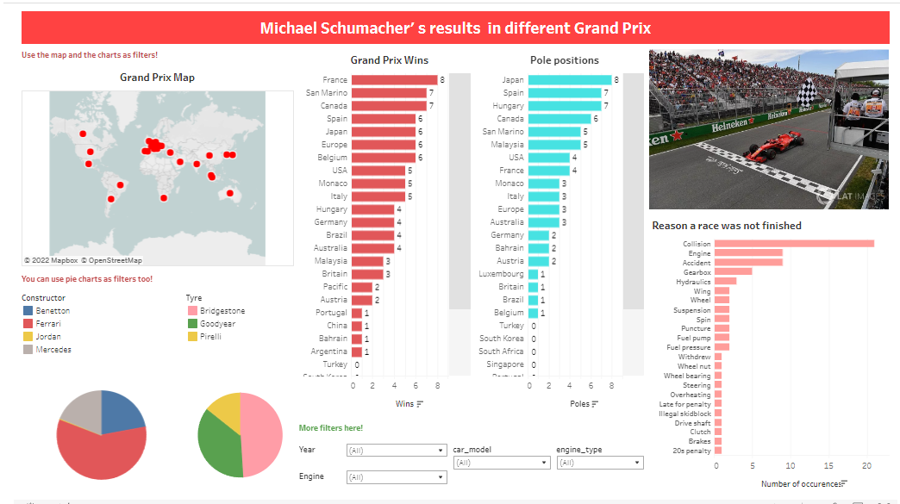
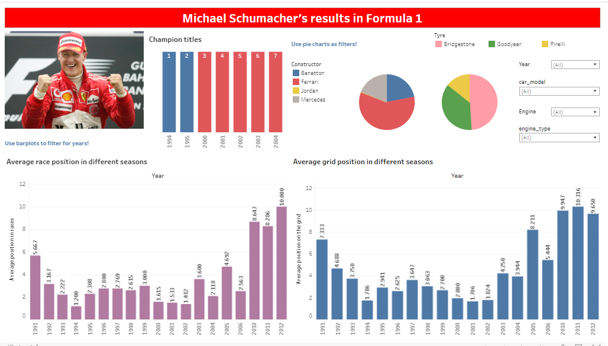
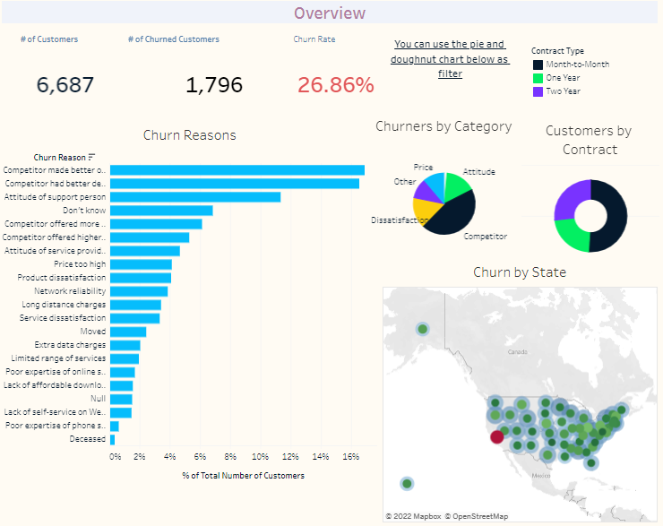
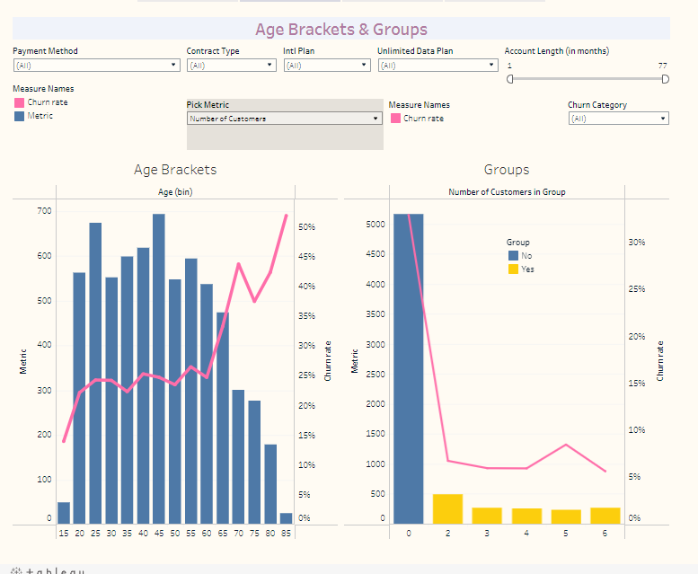
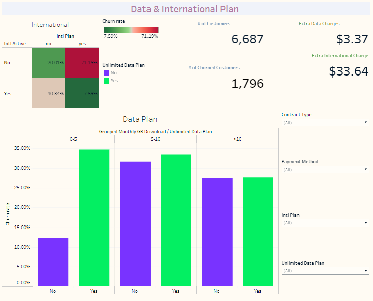
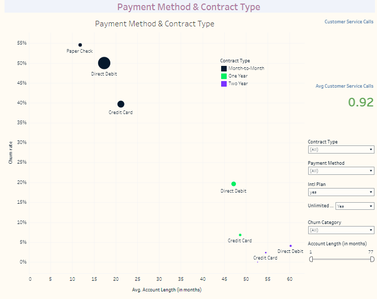

# My Tableau Dashboards & Visualizations

## Click on the images and they will take you to the corresponding tableau dashboards. Try it out! ##

## Michael Schumacher
Michael Schumacher's results in different Grand Prix 

<a href="https://public.tableau.com/app/profile/kate1758/viz/Michael_Schumacher/Results_in_grand_prix" target="_blank">.

Michael Schumacher's results in Formula 1 

<a href="https://public.tableau.com/app/profile/kate1758/viz/Michael_Schumacher/Results_in_seasons" target="_blank">

 
## Nobel Prize Winners 
Who are the Nobel Prize winners? 

<a href="https://public.tableau.com/app/profile/kate1758/viz/Nobel_prizes/WhoareNobelPrizewinners" target="_blank">

 
## Churn Analysis

Overview

<a href="https://public.tableau.com/app/profile/kate1758/viz/ChurnAnalysis_16573217917860/ChurnAnalysis" target="_blank">

 ##
 Age and Groups 

<a href="https://public.tableau.com/app/profile/kate1758/viz/ChurnAnalysis_16573217917860/ChurnAnalysis" target="_blank">

 ##
 Data plan and International calls

<a href="https://public.tableau.com/app/profile/kate1758/viz/ChurnAnalysis_16573217917860/ChurnAnalysis" target="_blank">

 ##
 Payment and contract type
 
<a href="https://public.tableau.com/app/profile/kate1758/viz/ChurnAnalysis_16573217917860/ChurnAnalysis" target="_blank">

 
